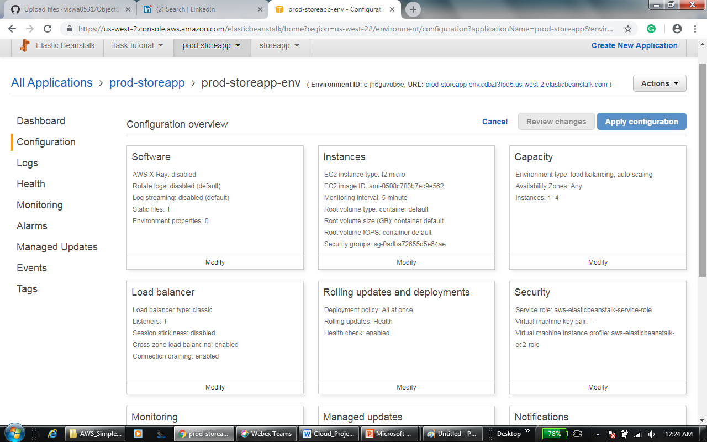

# ObjectStorageApp

Course Details

University Name: http://www.sjsu.edu/

Course: Cloud Technologies 

Professor: Sanjay Garje 

ISA: AnuShri Srinath Aithal

Website http://storeobjectapp.com/

### Object Storage App project Introduction
Object storage app is a web application hosted on Amazon web services which provide the users to save and access their files on cloud. It is 3 Tier Web Application which is highly available, durable and provides a scalable solution. User can register to a web application and login to it to upload and download the files to s3 bucket and the user can delete the file as well.  Admin has all the privileges to view user files and can delete or modify them and admin also has privileges to remove access to any user by deleting it.

### Basic 3 Tier Architecture

Basic Three Tier architecture consists of a web interface which can be used by end users or customers, A backend server for application development and deployment and the database for updating and retrieving the information to/from the end user and from developers. 

### Application Architecture

### Features and Specifications
    • Front end comprises of three pages
    i. Sign-Up Page
    ii. Login Page
    iii. Upload/download Page
    • Zero downtime maintenance of content delivery network using Route 53
    • Failover and load balancing for frontend and backend servers
    • Latency acceleration for downloading files from S3 using cloud front
    • Access to entire bucket goes through IAM policy

### Source Code details
    • Backend application server code is implemented in python
    • Database was handled by using PostgreSQL RDS
    • Frontend is based on flask application 
Source Code Structure:
Storeapp is the main directory of the project which contains application, and other directories such as templates, lib and static and Storeappenv 
Entire application was return in application.py using flask and python. It contains the implementation for 
    • Login
    • Sign-up
    • Upload
    • Update
    • Download
    • Delete
templates consists of all the html files and which will be rendered by the application based on user request.
Implementation of code for uploading, deleting and updating the files in s3 bucket is placed under lib/s3client.py
Code implementation for creating the RDS database tables for user information and also for maintaining the file information is available under lib/rds_client.py. 
Table structure is created in model.py under lib directory.
All the modules and dependencies that are installed for this application is updated in requirements.txt
Storeappenv is a virtual environment created to run the application in python 2.7

### AWS components used in this application

    • S3 bucket with multi AZ replication and versioning enabled
    • IAM is used for admin policy
    • EC2 Instances for web tier and application tier
    • RDS (PostgreSQL) for saving the user and file information 
    • Cloud front for content delivery network
    • Elastic Load Balancer
    • Auto Scaling Group
    • Elastic BeanStalk
    
### Deployment Instructions

#### Code Deployed throug code pipeline

#### Production Server

#### Development Server

#### IAM policy
I am policy is created for the administrator

#### Policy details

#### S3 Bucket Details

#### Route53 Configuration

#### EC2 Instances

### Code pipeline

#### S3 Bucket content

## Deployed Code ScreenShots

#### SignUp Page

#### Login Page

#### Upload Page

#### Uploading to S3 bucket

#### Downloading to S3 Bucket

#### After deleting a file from S3 bucket

